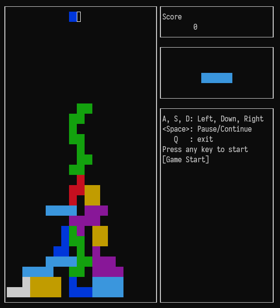

# Tetris Game

A tetris game run in terminal. The program is written in C++ and uses the ncurses library.



## Usage

`A`, `S`, `D`: Left, Down, Right

`<Space>`: Pause/Continue

`Q`: Quit

## Compile

### Linux

You should install `libncurses-dev` first.

```shell
# git clone first 
cd Tetris
mkdir build && cd build
cmake -DCMAKE_BUILD_TYPE=Release ..
make
```

Then you can run `build/tetris/tetris`.

### Windows

You can use MinGW-w64 with ncurses library.

Specify `NCURSES_INC_DIR` and `NCURSES_LIB_DIR` in `CMakeLists.txt`, or use cmake parameter `-DNCURSES_INC_DIR=<your dir>` and `-DNCURSES_LIB_DIR=<your dir>`.

Then compile like on linux.
